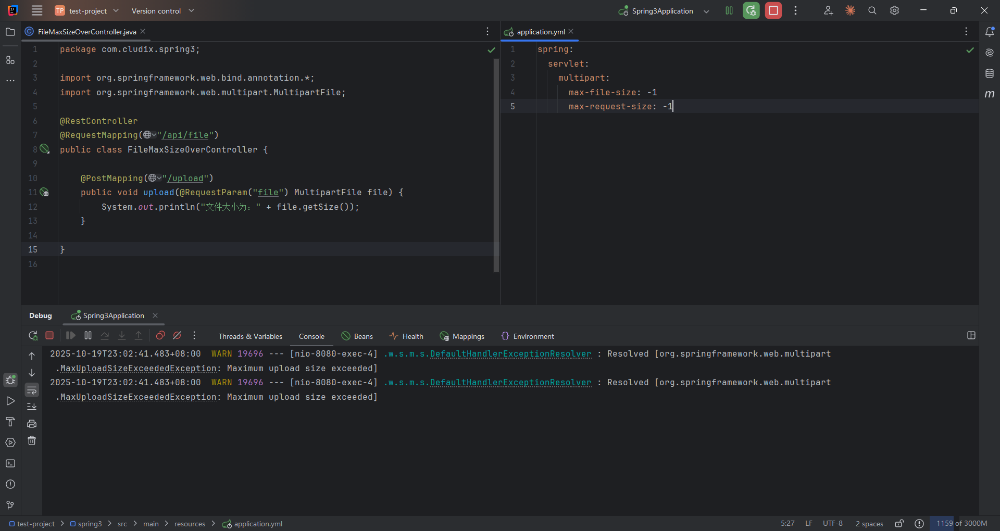

# 文件上传报错

## 问题现象

在 Spring Boot 应用中实现文件上传功能时，遇到了 `MaxUploadSizeExceededException: Maximum upload size exceeded` 异常。尽管已经在配置文件中将最大文件大小和最大请求大小都设置为无限制，但上传文件时仍然出现该错误。




## 原因分析

从表面上看，异常提示似乎是请求大小超出了限制，但即使将 Spring Boot 的文件上传配置参数 `max-file-size` 和 `max-request-size` 都设置为 `-1`（表示无限制），问题依然存在。

经过排查发现，问题的根本原因并非文件本身大小超出限制，而是 **multipart 请求头大小超出了 Tomcat 的限制**。

### 技术原理

Spring Boot 默认使用 Tomcat 作为嵌入式服务器。在处理 `multipart/form-data` 类型的文件上传请求时，Tomcat 会将请求拆分为多个部分（part），每个部分都包含请求头信息。Tomcat 提供了 `max-part-header-size` 配置项来限制每个部分的请求头大小。

当上传的文件名过长时，文件名作为请求头的一部分，其大小可能超过 Tomcat 默认的 512 字节限制，从而触发 `MaxUploadSizeExceededException` 异常。

## 解决方案

### 配置调整

在 `application.yml` 配置文件中增加 `max-part-header-size` 配置项：

```yml
server:
  tomcat:
    max-part-header-size: 10240B  # 10KB
```

### 推荐配置

- **默认值**：512B
- **推荐值**：10240B（10KB）
- **最大值**：根据实际业务需求，可设置为更大的值

### 配置说明

- 该配置项控制的是 multipart 请求中每个部分的请求头大小限制
- 文件名过长、请求头字段过多都可能导致超出此限制
- 建议根据实际业务场景设置合理的值，避免设置过大带来安全风险

## 总结

遇到文件上传相关的 `MaxUploadSizeExceededException` 异常时，需要从多个维度进行排查：

1. **文件大小限制**：检查 `spring.servlet.multipart.max-file-size` 和 `spring.servlet.multipart.max-request-size` 配置
2. **请求头限制**：检查 `server.tomcat.max-part-header-size` 配置，特别是当文件名较长时
3. **其他可能的限制**：如 Nginx 的 `client_max_body_size`、网络代理的设置等

本案例中，问题的根本原因在于 Tomcat 的 `max-part-header-size` 默认值较小（512B），当文件名过长时会导致请求头超出限制。通过适当调整该配置值即可解决问题。
