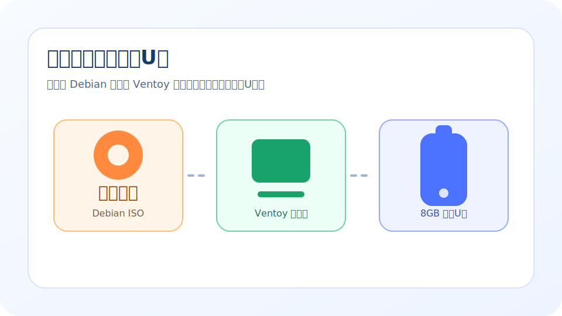
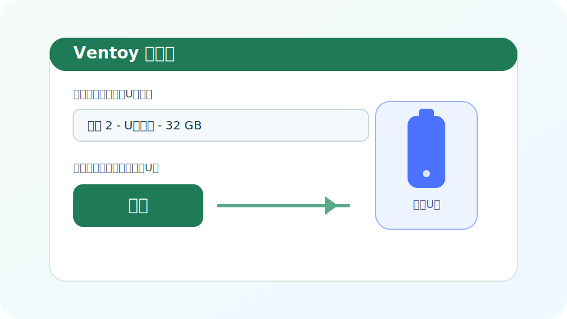
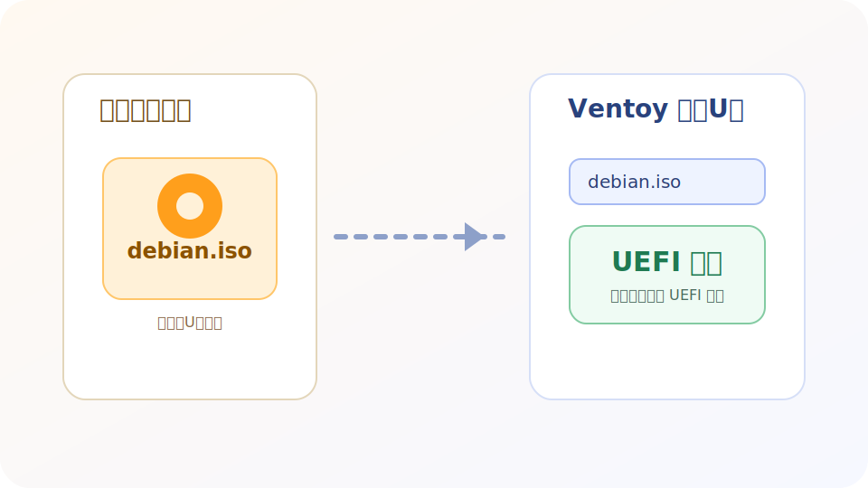

本文档介绍如何使用 Ventoy 制作 Debian 启动 U 盘，供物理机安装或在 VMware 等虚拟化场景中透传启动使用。

<!-- truncate -->

## 准备工作

开始之前，请先准备以下内容：

1. 一个容量不小于 8GB 的 U 盘
2. 从 Debian 官网下载好的 ISO 镜像文件
3. 从 [Ventoy 官网](https://www.ventoy.net/cn/index.html) 下载对应系统版本的安装包

:::warning 数据风险
Ventoy 安装过程会重写目标 U 盘分区表并清空原有数据，请先确认 U 盘内的重要文件已经备份。
:::

## 安装 Ventoy 到 U 盘

1. 将 U 盘插入宿主机
2. 解压并启动 Ventoy 安装程序
3. 在设备列表中选择目标 U 盘
4. 点击安装，并根据提示确认写入操作
5. 等待安装完成后重新插拔 U 盘

完成后，U 盘会被初始化为 Ventoy 启动盘，并出现可用于存放镜像文件的分区。

## 复制 Debian 镜像

1. 打开 U 盘中可见的数据分区
2. 直接将 Debian ISO 文件复制到该分区根目录或自定义目录中
3. 等待复制完成后安全弹出 U 盘

Ventoy 的常见用法是不需要再额外“刻录”ISO，复制镜像文件即可在启动菜单中识别。

## 启动方式检查

为了配合本文档仓库中的 VMware 安装流程，建议在使用前确认以下几点：

- 优先使用支持 UEFI 启动的 ISO 镜像
- 在目标机器或虚拟机中启用 UEFI 固件
- 如果同一个 U 盘内放置了多个镜像，启动时从 Ventoy 菜单中选择 Debian ISO

## 常见问题

### 复制完 ISO 后看不到启动项

- 确认 ISO 文件复制已完成且文件未损坏
- 重新插拔 U 盘后再次检查文件是否存在
- 尝试将 ISO 放在分区根目录，避免路径过深

### 虚拟机里识别不到 U 盘

这通常不是 Ventoy 制作失败，而是 VMware 没有将 USB 设备正确连接到虚拟机。可继续参考 [VMware 使用 U 盘安装 Debian 系统](../vmware-usb-debian/index.md) 中的 USB 控制器和启动顺序设置。
