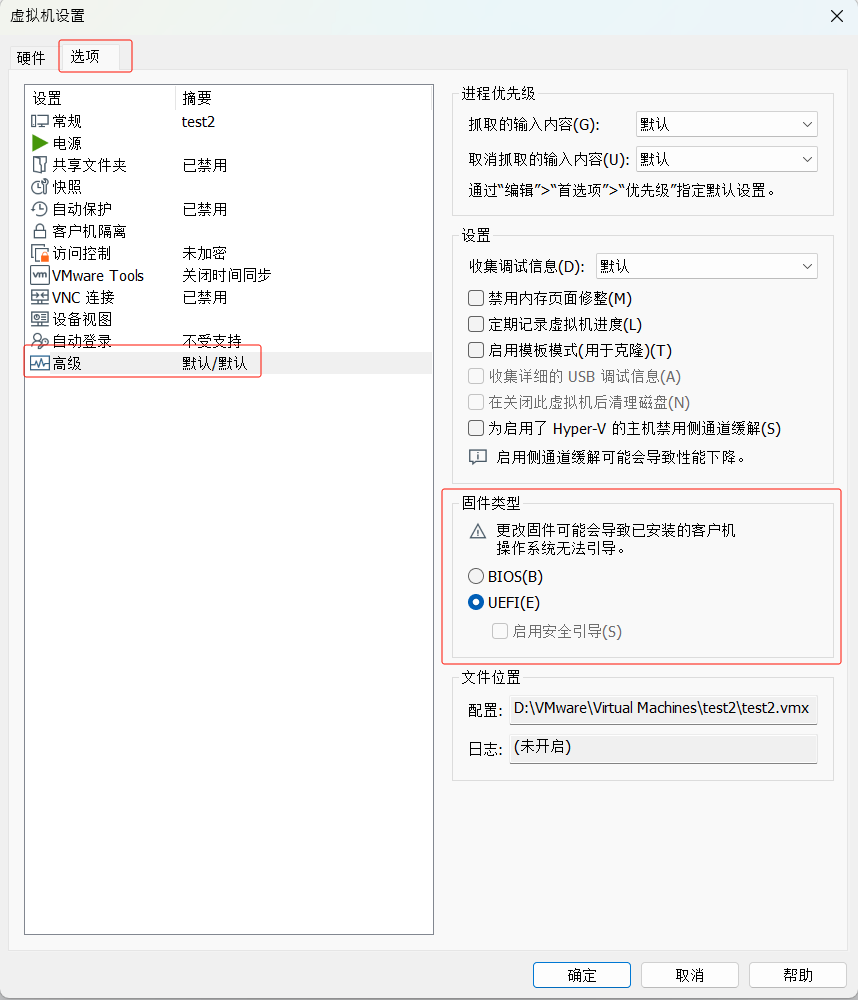

本文详细介绍在VMware Workstation中如何使用U盘安装Debian系统，以Debian 13（代号Trixie）为例。

<!-- truncate -->

## 准备工作

推荐使用[Ventoy](https://www.ventoy.net/cn/index.html)制作一个多系统启动U盘，Ventoy支持同时存放多个ISO镜像文件，非常方便。具体使用方法将在后续文章中详细介绍。

:::tip 启动方式说明
制作启动U盘时，务必选择 **UEFI** 作为启动方式，以确保与虚拟机固件类型匹配。
:::

## 创建虚拟机

1. 打开VMware Workstation，创建新的空白虚拟机
2. 在"客户机操作系统"选择界面：
   - 操作系统：Linux
   - 版本：Debian 12.x（即使安装Debian 13也选择此版本，完全兼容）
3. 其他配置保持默认设置

:::tip 硬件配置建议
- CPU核心数：根据宿主机性能设置，建议至少2核心
- 内存大小：建议至少4GB
- 磁盘空间：建议至少50GB
:::

## 虚拟机设置优化

### 固件类型设置

为确保能够识别U盘启动，需要将虚拟机固件设置为UEFI模式：

1. 右键点击虚拟机 → "编辑虚拟机设置"
2. 切换到"选项"标签页
3. 选择"高级"选项
4. 确认"固件类型"设置为"UEFI"

### USB控制器配置

现代U盘大多为USB 3.0/3.1标准，因此需要配置虚拟机的USB控制器：

1. 在虚拟机设置中找到"USB控制器"
2. 将兼容性设置为"USB 3.1"
3. 勾选"显示所有USB输入设备"选项

:::tip USB连接说明
启用"显示所有USB输入设备"选项可确保U盘连接到虚拟机而非宿主机，避免识别问题。
:::

## 启动虚拟机并连接U盘

### 连接U盘到虚拟机

1. 将制作好的Debian启动U盘插入宿主机
2. 启动之前创建的虚拟机
3. 首次启动时，虚拟机可能无法直接识别U盘，需要手动连接：
   - 在VMware界面中找到U盘设备
   - 右键点击选择"连接（断开与主机的连接）"

### 设置U盘为优先启动项

1. 重启虚拟机
2. 在启动过程中迅速连续按F2键进入BIOS设置
3. 进入Boot菜单，使用方向键选择"EFI USB Device"
4. 按回车键确认选择

等待片刻后，系统将进入Debian安装界面：

:::tip 操作注意事项
- 点击重启按钮后，务必将鼠标焦点移入虚拟机窗口，否则F2快捷键无效
- 进入BIOS的时机很重要，需要在VMware启动画面出现时快速操作
:::

## 安装Debian系统

### 系统语言设置

1. 在启动菜单中选择"Graphical Install"进入图形化安装界面
2. 选择安装语言为"中文(简体)"
3. 选择地区为"中国"
4. 配置键盘布局（通常保持默认设置）

### 磁盘分区配置

**关键步骤**：在磁盘分区环节，请务必选择VMware创建的虚拟磁盘，而非U盘设备：

- 正确目标：类似`VMware`的虚拟磁盘
- 避免选择：U盘设备（通常容量较小）

:::warning 重要提醒
磁盘分区是最关键的操作，请务必确认选择的磁盘设备，错误操作可能导致数据永久丢失！
:::

### 完成安装

1. 根据个人需求配置用户账户、主机名等信息
2. 选择安装的软件包（建议保持默认选择）
3. 等待系统安装完成
4. **重要**：在重启前，先断开U盘与虚拟机的连接，避免再次进入安装程序
5. 完成重启后，即可正常使用Debian系统

## 总结

通过以上步骤，您已成功在VMware虚拟机中使用U盘安装了Debian系统。这种方法相比直接挂载ISO文件更接近真实物理机的安装体验，同时也能够测试启动盘的可用性。