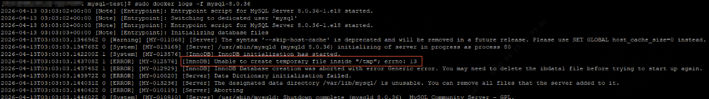
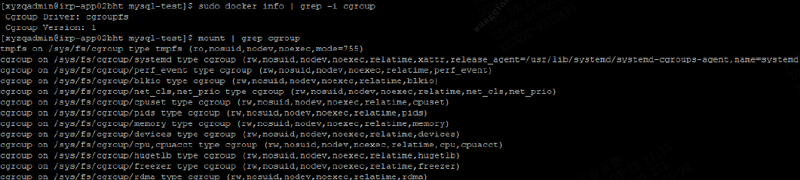

本文记录在麒麟v10系统上部署Docker MySQL容器时，因cgroupfs tmpfs目录权限配置问题导致的启动失败及其解决方案。

<!-- truncate -->

## 问题背景

在麒麟v10（Kylin V10）操作系统上使用Docker部署MySQL服务时，容器无法正常启动，日志报错信息提示权限相关问题。

### 环境信息

- 操作系统：麒麟v10 SPx
- Docker版本：26.1.0
- Docker存储驱动：cgroupfs
- MySQL镜像：mysql:8.x

## 问题现象

### 错误日志

启动MySQL容器后，查看容器日志发现权限相关错误：



### 容器状态

```bash
docker ps -a
# 容器状态为 Exited 或反复重启
```

## 问题原因分析

### Docker cgroupfs 存储驱动

本环境Docker使用 `cgroupfs` 作为存储驱动，而非 `overlay2`。cgroupfs模式下，容器对tmpfs目录的访问权限直接受宿主机配置影响。

### 查看tmpfs目录权限配置

通过命令检查系统cgroupfs中tmpfs目录的权限配置：

```bash
mount | grep cgroup
```

执行后可以看到tmpfs目录的权限配置情况：



从截图可见，麒麟v10系统默认的tmpfs目录权限配置与常规Linux发行版存在差异，权限过于严格。

### MySQL容器运行用户

MySQL容器内部进程以 `mysql` 用户（非root用户）身份运行。当tmpfs目录权限不足时，`mysql` 用户无法在该目录下创建或访问临时文件，导致服务启动失败。

:::info 为什么MySQL使用mysql用户运行
MySQL官方镜像出于安全考虑，容器内服务不以root用户运行。这是Docker安全最佳实践的体现，但也意味着容器对宿主机挂载目录的权限更加敏感。
:::

### 根因总结

| 因素 | 说明 |
|---|---|
| Docker存储驱动 | 使用cgroupfs，容器权限继承宿主机配置 |
| 麒麟v10默认配置 | tmpfs目录权限策略更严格 |
| MySQL运行用户 | 容器内以mysql用户运行，非root |
| 结果 | mysql用户无权限访问tmpfs，启动失败 |

## 解决方案

### 方案一：修改宿主机tmpfs权限

修改宿主机tmpfs目录权限，将默认的「仅root读写」改为「所有人读写」：

```bash
# 修改tmpfs目录权限为所有人可读写执行
chmod 1777 /sys/fs/cgroup/tmpfs
```

:::tip 关于1777权限
- `777`：所有人可读写执行
- `1`（前缀）：设置sticky bit，防止用户删除他人创建的文件
:::

修改后确认权限已变更：

```bash
ls -la /sys/fs/cgroup/tmpfs
# 应显示 drwxrwxrwt 权限（所有人可读写，sticky bit已设置）
```

**优点**：一劳永逸，所有容器均可受益

**缺点**：降低了系统安全性，需要评估是否符合生产环境安全规范

### 方案二：挂载处理好的目录

在容器层面绕过宿主机tmpfs权限问题，通过挂载一个权限正确的目录替代默认tmpfs：

#### 方式A：自定义目录挂载

在宿主机创建一个权限正确的目录，并挂载到容器内：

```bash
# 创建自定义目录并设置权限
mkdir -p /app/mysql-tmp
chmod 1777 /app/mysql-tmp
```

docker-compose配置：

```yaml
services:
  mysql:
    image: mysql:8.x
    volumes:
      - /app/mysql-tmp:/tmp
      # 其他挂载配置...
```

#### 方式B：Docker数据卷

使用Docker管理的命名卷：

```yaml
services:
  mysql:
    image: mysql:8.x
    volumes:
      - mysql-tmp:/tmp
      # 其他挂载配置...

volumes:
  mysql-tmp:
    # Docker自动管理，权限默认正确
```

#### 方式C：tmpfs挂载配置

在docker-compose中声明tmpfs挂载并指定权限模式：

```yaml
services:
  mysql:
    image: mysql:8.x
    tmpfs:
      - /tmp:size=100M,mode=1777
      - /var/tmp:size=100M,mode=1777
    # 其他配置...
```

:::info tmpfs挂载说明
通过Compose声明tmpfs时，Docker会创建独立的tmpfs实例，不受宿主机tmpfs配置影响，可直接指定权限模式。
:::

**优点**：不影响宿主机整体安全性，仅针对特定容器处理

**缺点**：需要为每个受影响的容器单独配置

## 验证步骤

1. 应用解决方案后，重新启动MySQL容器：

```bash
docker compose -f /app/docker-compose.mysql.yml up -d
```

2. 检查容器状态：

```bash
docker ps
# 确认容器状态为 Up
```

3. 验证MySQL服务可用：

```bash
docker exec -it mysql mysql -uroot -p
```

## 注意事项

- 该问题为麒麟v10系统特有，其他Linux发行版通常不受影响
- 生产环境建议在部署前预先检查系统tmpfs配置
- 若使用其他以非root用户运行的容器（如Redis、PostgreSQL），可能遇到类似问题
- Docker使用overlay2驱动时，该问题通常不会出现

## 相关文档

- [MySQL Docker Compose 配置](/docs/operations/mysql-compose)
- [Docker 部署规范](/docs/operations/docker/deployments/)