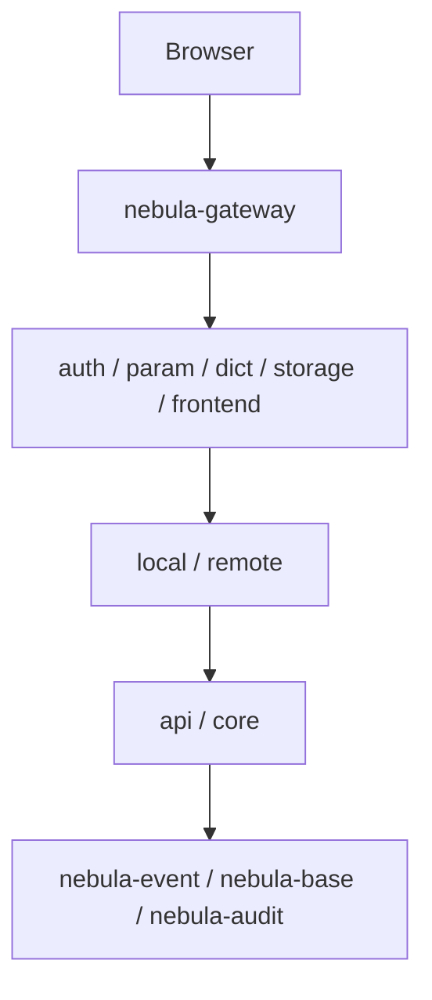

# 扩展点与领域事件

nebula 提供丰富的**用户可扩展点**，主要分为两类：

- **同步 Hook**（SPI）：写操作前后拦截同事务
- **领域事件**：写成功后的异步通知

## 平台架构图

## Hook vs Event 对比

| 维度 | Hook | 领域事件 |
|---|---|---|
| 时机 | 写库前后同事务 | 写成功后异步通知 |
| 作用 | 拦截/联动/校验 | 跨模块通知/缓存刷新 |
| 注册位置 | 必须在**真正执行写入**的进程里 | 可在任何服务里注册 |
| 异常处理 | `before*` 抛 `BusinessException` 即中止 | 事件发布后不影响写库 |

## 扩展点清单

- 详见 [扩展点与领域事件清单](./hooks-events.md)

## 推荐阅读

- 所有模块的 `design-and-implementation.md` 都有「扩展点与领域事件」章节
- 事件监听示例见 `usage-guide.md` 中的 `@NebulaEventListener`
- Hook Bean 示例见 `usage-guide.md` 中的 `@Component`

## 下一页

- [所有 Hook + Event 清单](./hooks-events.md)
