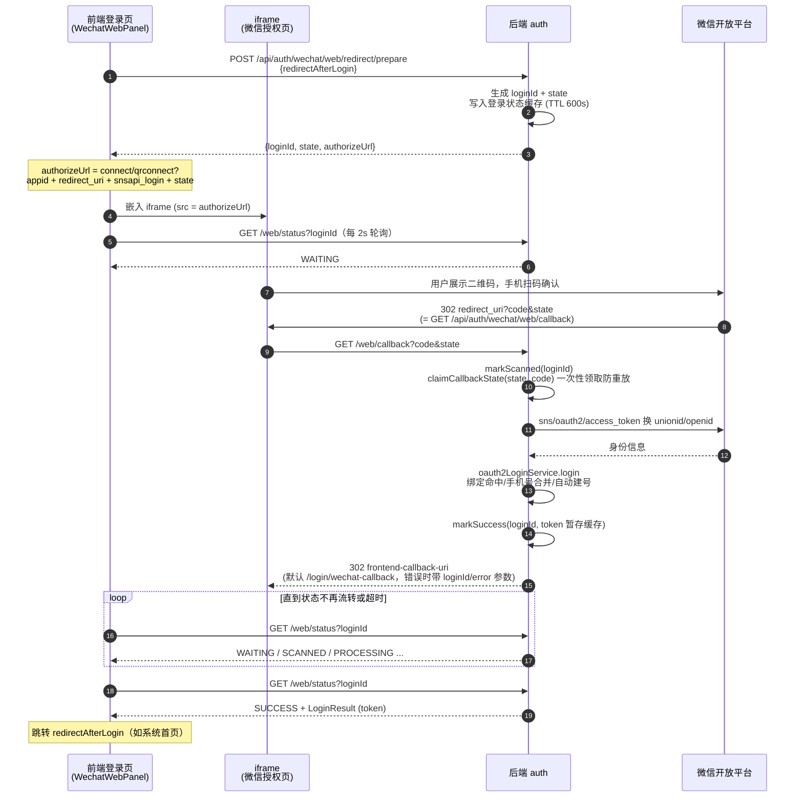
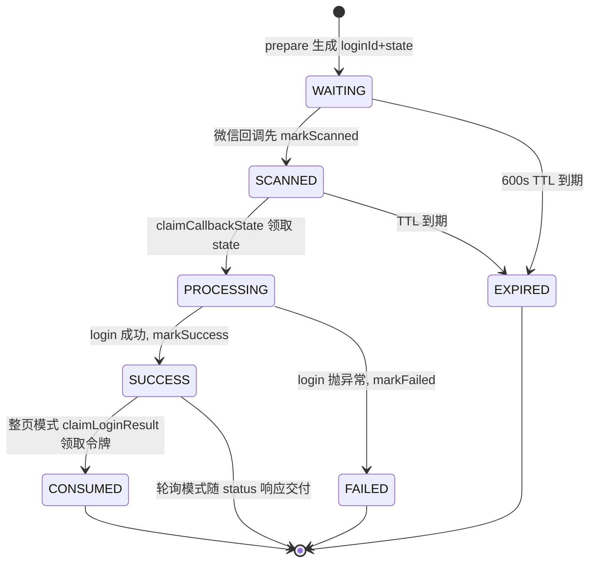
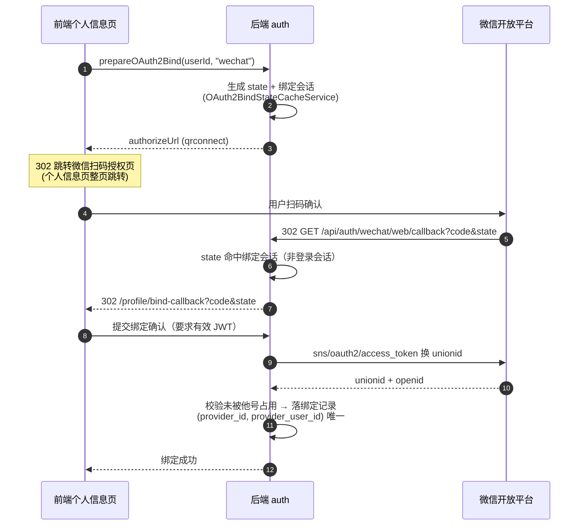

# 微信扫码绑定与小程序账号互通

本文覆盖 Nebula 微信登录的两个话题：**Web 扫码登录的完整时序**（登录页 iframe 内嵌二维码 + 轮询）与**扫码绑定**（个人信息页，供小程序账号互通）。两者的微信侧交互同源，共用一个 302 回调入口。

## 1. 问题背景

Nebula 的微信登录是一个 provider（providerId `wechat`）覆盖两个渠道：

- **小程序渠道（mini）**：`wx.login()` 直连式登录，无浏览器重定向环节，因此**不能**在小程序里做「绑定」交互
- **网站应用渠道（web）**：开放平台「网站应用」，浏览器重定向式，天然支持绑定流程

「个人信息页绑定微信」因此设计为 **Web 端扫码完成**，小程序端零绑定代码。绑定的意义由 unionid 放大：绑定动作落的是统一身份，两个渠道共享。

---

## 2. Web 扫码登录完整流程

### 2.1 时序总览

涉及三方四端：**前端登录页**（主页面，嵌 iframe 并轮询）、**后端 auth**、**微信开放平台**、以及 iframe 内部跳转的**微信扫码授权页**。令牌不经过 URL，始终由后端暂存、前端轮询领取。

### 2.2 关键设计点

- **令牌不进 URL**：扫码成功后令牌暂存在登录状态缓存（`markSuccess`），主页面轮询 `GET /web/status` 时随响应交付。iframe 内的 302（`frontend-callback-uri`）只是回调处理后的技术承接页，不带令牌；整页重定向接入方式下，前端承接页再用 `POST /web/redirect/callback` 一次性领取（claim 语义，领过即失效）。
- **state 一次性领取**：`claimCallbackState(state, code)` 用原子领取替代「查询 + 比对」，state 被消费后立即写入 30 秒墓碑（TOMBSTONE），重放请求直接命中 `CONSUMED`。
- **绑定期分叉**：回调处理时先查绑定会话缓存（`OAuth2BindStateCacheService`），state 属于绑定会话则转发前端绑定承接页（`/profile/bind-callback`），不进入登录流程。
- **前端不建 `/login/wechat-callback` 路由**：iframe 模式下这次导航发生在即将销毁的 iframe 内部，用户无感；配置保留是给整页重定向接入方式和排障（错误码透出）用的。

### 2.3 登录会话状态机

`loginId` 对应的登录会话是封闭生命周期（`OAuth2LoginStatus`），前端轮询拿到的就是这个状态：

状态含义：`WAITING` 等待扫码 / `SCANNED` 已扫码待确认 / `PROCESSING` 回调处理中 / `SUCCESS` 登录成功（令牌待领取）/ `FAILED` 授权或登录失败 / `EXPIRED` 会话过期 / `CONSUMED` 令牌已被领取。

---

## 3. unionid 互通原理

微信开放平台为同一主体下的多个应用提供统一身份：

| 场景 | 同一微信用户解析结果 |
|---|---|
| 网站应用扫码（开放平台） | `unionid` + 该应用的 `openid` |
| 小程序（已绑定到同一开放平台账号） | **同一个** `unionid` + 小程序自己的 `openid` |
| 小程序（未绑定开放平台） | 只有 `openid`，**两渠道账号不互通** |

Nebula 的设计决策：

- `providerUserId = unionid || openid`：优先统一标识，退回渠道内标识
- 绑定表 `auth_oauth2_account` 按 `(provider_id, provider_user_id)` 唯一
- 渠道细节记录在 `provider_attributes.channel`（`mini` / `web`），不参与身份匹配

因此「Web 扫码绑定 → 小程序直接登录同一账号」不需要小程序侧写任何绑定逻辑：扫码落一条 `(wechat, unionid)` 绑定，小程序登录时 unionid 命中同一条记录。

> 注意：绑定记录 attributes 里的 `openid` 是**网站应用**的 openid，与小程序 openid 不同。匹配只看 unionid，不要拿 attributes 里的 openid 反查小程序侧信息。

---

## 4. 扫码绑定流程（Web 个人信息页）

绑定与登录共用同一个微信 302 回调入口，回调内先查绑定会话缓存，命中即走绑定分支：

要点：

- 绑定复用扫码登录的 302 回调入口（`GET /api/auth/wechat/web/callback`），回调内先查绑定会话缓存，命中即转发前端承接页，不进入登录流程——与 GitHub 的绑定回调机制一致
- state 防 CSRF 由绑定会话缓存承担；请求级防伪由「绑定接口要求有效 JWT」兜底
- 该微信身份已被其他账号绑定时，走既有的 takeover 确认流程（二次确认迁移）

---

## 5. 登录侧如何命中绑定

**小程序登录**（`POST /api/auth/wechat/mini-login`）：

1. `jscode2session` 解析出 `unionid`（或退回 `openid`）
2. 按 `(wechat, providerUserId)` 查绑定表 → 命中即登录该账号
3. 未命中且身份带手机号（`getPhoneNumber`，微信验证过）→ 按手机号查既有账号，命中则**自动合并**（把微信身份绑到该账号）
4. 均未命中且允许注册 → 自动建号

**扫码登录**（`prepare` → `callback` → `status` 三段式，与 GitHub 同机制）：登录成功同样落在绑定表或新建用户，后续小程序登录直接互通。

手机号合并是账号归一的兜底：即使不走扫码绑定，手机号一致的两个入口也会自动收敛到同一账号。

---

## 6. 绑定入口的显隐规则

`OAuth2ProviderClient.supportsBinding()` 按渠道回答：

| 渠道配置状态 | `supportsBinding()` | 绑定列表表现 |
|---|---|---|
| 仅配置 `mini` | `false` | 绑定列表**隐藏**微信条目，绑定/解绑接口直接拒绝 |
| 配置了 `web`（无论 mini 是否配置） | `true` | 绑定列表显示「微信」，发起绑定走 `qrconnect` 授权地址 |

授权地址由 provider 的 `buildAuthorizeUrl(state)` 生成（`connect/qrconnect` + appid + redirect_uri + snsapi_login + state），编排层不感知微信配置细节。

---

## 7. 前置条件与运维检查单

1. **开放平台绑定关系**：小程序必须绑到与网站应用相同的开放平台账号，否则 unionid 不下发、账号不互通——这是整个方案成立的前提，联调前先在开放平台后台确认
2. **两套凭据**：网站应用与小程序的 AppID/AppSecret 是两套，分别配在 `web.*` 与 `mini.*` 下；secret 用环境变量注入（`NEBULA_AUTH_WECHAT_WEB_APP_SECRET` / `NEBULA_AUTH_WECHAT_MINI_APP_SECRET`）
3. **授权回调域**：开放平台后台配置的授权回调域必须覆盖 `web.redirect-uri` 所在域名
4. **企业认证**：小程序 `getPhoneNumber` 需要已认证的企业主体；个人主体小程序拿不到手机号，账号互通完全依赖扫码绑定
5. **开关**：`login.oauth2.enabled` 与 `login.oauth2.provider.wechat.enabled` 两个系统参数同时为 true
6. **access_token 缓存**：多实例部署必须走 Redis（`nebula.cache.type: redis`），否则实例间互相踢微信全局 token
