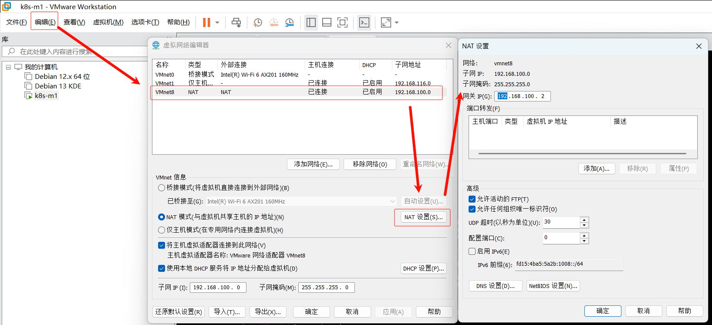

本文档基于 VMware NAT 模式下安装的 Debian 13 系统，介绍如何配置静态IP地址。本教程适用于最小化安装的 Debian 13 系统。

## 了解NAT配置

首先需要在 VMware 中确认NAT网络配置：

1. 打开 VMware 虚拟网络编辑器：`编辑` → `虚拟网络编辑器`
2. 选择 `NAT模式` (通常为 VMnet8)
3. 点击 `NAT设置` 查看详细网络参数



在 NAT 设置界面中，您可以看到：
- **子网IP**: 网络地址段
- **子网掩码**: 子网掩码
- **网关IP**: 默认网关地址

> 💡 **建议**: 如果您对网络配置不熟悉，建议使用默认设置，避免因误改导致网络连接失败。

## 网络配置修改

### 1. 识别网络接口

首先使用 `ip link show` 命令查看系统中的网络接口：

```bash
root@k8s-m1:~# ip link show
1: lo: <LOOPBACK,UP,LOWER_UP> mtu 65536 qdisc noqueue state UNKNOWN mode DEFAULT group default qlen 1000
    link/loopback 00:00:00:00:00:00 brd 00:00:00:00:00:00
2: ens33: <BROADCAST,MULTICAST,UP,LOWER_UP> mtu 1500 qdisc fq_codel state UP mode DEFAULT group default qlen 1000
    link/ether 00:0c:29:d8:f8:5a brd ff:ff:ff:ff:ff:ff
    altname enp2s1
    altname enx000c29d8f85a
```

**网络接口说明**:
- `lo`: 本地回环接口，IP地址为 127.0.0.1
- `ens33`: 以太网卡接口（这是本例中的实际网卡名称，您的系统可能不同）

> ⚠️ **注意**: 不同系统或虚拟机环境下的网卡名称可能不同，如 `eth0`、`ens160` 等。请根据实际情况记录您的网卡名称。

### 2. 配置静态IP

#### 查看当前网络配置

首先查看当前的网络配置文件：

```bash
cat /etc/network/interfaces
```

默认情况下，您应该看到类似如下的内容（使用DHCP自动获取IP）：

```bash
# This file describes the network interfaces available on your system
# and how to activate them. For more information, see interfaces(5).

source /etc/network/interfaces.d/*

# The loopback network interface
auto lo
iface lo inet loopback

# The primary network interface
allow-hotplug ens33
iface ens33 inet dhcp
```

#### 修改为静态IP配置

使用 `vim` 或您偏好的文本编辑器修改配置文件：

```bash
vim /etc/network/interfaces
```

将配置修改为静态IP模式：

```bash
# This file describes the network interfaces available on your system
# and how to activate them. For more information, see interfaces(5).

source /etc/network/interfaces.d/*

# The loopback network interface
auto lo
iface lo inet loopback

# The primary network interface
allow-hotplug ens33
# iface ens33 inet dhcp  # 注释掉原来的DHCP配置
iface ens33 inet static
    address 192.168.100.10
    netmask 255.255.255.0
    gateway 192.168.100.2
    dns-nameservers 223.5.5.5 8.8.8.8
```

**配置参数说明**:
- `address 192.168.100.10`: 静态IP地址（主机位 `.10` 可根据需要设置，网络段需与NAT配置一致）
- `netmask 255.255.255.0`: 子网掩码（与NAT设置中的子网掩码保持一致）
- `gateway 192.168.100.2`: 默认网关（与NAT设置中的网关IP保持一致）
- `dns-nameservers 223.5.5.5 8.8.8.8`: DNS服务器（分别使用阿里DNS和谷歌DNS，可替换为其他DNS）

> 📝 **提示**: 请根据您在VMware NAT设置中看到的实际网络参数调整上述配置值。

### 3. 应用并验证配置

#### 重启网络服务

配置修改完成后，重启网络服务以应用新设置：

```bash
systemctl restart networking
```

#### 验证网络配置

1. **检查IP地址**:
   ```bash
   ip addr show ens33
   ```

   确认 `ens33` 网卡的IP地址已更改为您设置的静态地址（如 `192.168.100.10`）。

2. **测试网络连通性**:
   ```bash
   # 测试与网关的连通性
   ping -c 4 192.168.100.2

   # 测试与外网的连通性
   ping -c 4 baidu.com
   ```

3. **检查DNS解析**:
   ```bash
   nslookup baidu.com
   ```

#### 故障排除

如果遇到网络连接问题，可以尝试以下解决方案：

1. **检查配置文件语法**:
   ```bash
   ifup -v ens33
   ```

2. **重启系统**:
   ```bash
   reboot
   ```

3. **检查防火墙设置**:
   ```bash
   iptables -L
   ```

> ✅ **完成**: 如果上述测试都通过，说明您的静态IP配置已成功完成！