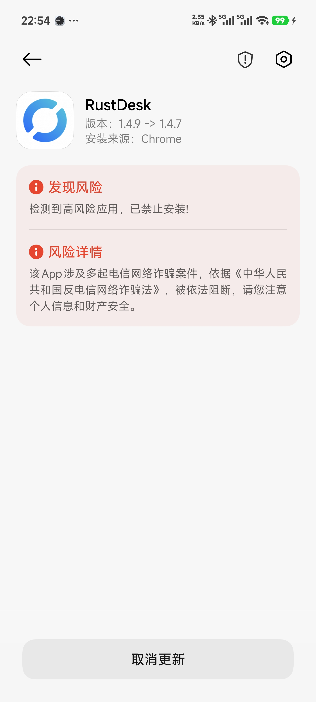

# 小米手机安装 RustDesk 被拦截的解决方法

## 问题现象

在小米手机上直接打开 RustDesk APK 安装包时，系统可能提示“检测到高风险应用，已禁止安装”，无法继续安装。



本文以电脑通过 ADB 安装为解决方案。**仅应安装从 RustDesk 官方发布渠道获取的已签名 APK**；不要通过 ADB 安装来源不明或被篡改的安装包。

## 原因说明

这是小米系统对侧载 APK 的风险控制。截图中的提示会根据应用特征和系统安全策略阻止本机安装，并不表示 APK 文件一定损坏。

ADB 安装属于开发调试通道：需要在手机上主动开启 USB 调试，并在连接电脑时确认 RSA 调试授权。它不是绕过手机安全设置的方式；手机未授权时，ADB 不会获得安装权限。

## 解决方案：通过 ADB 安装

### 1. 准备 APK 与 ADB

在电脑上准备 RustDesk APK，例如：

```text
rustdesk-1.4.9-universal-signed.apk
```

确认 Mac 已安装 Android Platform-Tools。若尚未安装，请阅读 [macOS 配置 Android 最小开发环境](../../tutorials/macos/macOS配置Android开发环境#6-连接-android-真机并验证) 中的“连接 Android 真机并验证”章节。

### 2. 在小米手机上开启 USB 调试

不同 MIUI / HyperOS 版本的菜单名称可能略有不同，通常按以下路径操作：

1. 打开“设置” > “我的设备”或“关于手机”。
2. 打开“全部参数与信息”“详细信息与规格”或同类页面。
3. 连续点击“OS 版本”或“MIUI 版本” 7 次，按提示输入锁屏密码，开启开发者选项。
4. 返回“设置” > “更多设置” > “开发者选项”。
5. 开启“USB 调试”，并确认风险提示。

使用支持数据传输的 USB 线连接手机和电脑。首次连接时，解锁手机，并在“是否允许 USB 调试”的 RSA 授权弹窗中选择“允许”；如有“始终允许使用这台计算机进行调试”，可按需勾选。

### 3. 确认设备已授权

在 APK 所在目录执行：

```bash
adb devices
```

只有看到设备序列号和 `device` 状态时，才可以继续安装：

```text
List of devices attached
XXXXXXXX	device
```

### 4. 安装 RustDesk

执行：

```bash
adb install -r rustdesk-1.4.9-universal-signed.apk
```

`-r` 表示保留应用数据并覆盖安装已有版本。首次安装时不需要该参数，也可以使用：

```bash
adb install rustdesk-1.4.9-universal-signed.apk
```

安装成功会输出：

```text
Success
```

## 处理 `adb: device unauthorized`

执行安装命令时，可能出现：

```text
adb: device unauthorized.
This adb server's $ADB_VENDOR_KEYS is not set
Try 'adb kill-server' if that seems wrong.
Otherwise check for a confirmation dialog on your device.
```

关键问题是 `device unauthorized`：当前电脑的 ADB RSA 公钥尚未被手机授权。`$ADB_VENDOR_KEYS is not set` 通常不是需要单独配置的错误；macOS 上 ADB 会默认使用当前用户目录下的密钥。

按下面顺序处理：

1. 解锁手机，查看是否有 USB 调试 RSA 授权弹窗，并选择“允许”。
2. 电脑执行以下命令后重新查看设备状态：

   ```bash
   adb kill-server
   adb start-server
   adb devices
   ```

3. 如果设备仍显示 `unauthorized` 且没有弹窗，在手机的“开发者选项”中选择“撤销 USB 调试授权”，再拔插数据线并重新确认授权。
4. 确认 USB 调试开关仍处于开启状态，并保持手机解锁。

完成授权后，`adb devices` 应显示 `device`，再重新执行安装命令。

## 其他常见问题

### `adb devices` 没有显示设备

- 确认使用的是支持数据传输的数据线，而不是只能充电的线。
- 重新插拔 USB 线，并保持手机解锁。
- 在手机 USB 用途提示中选择“文件传输”，然后执行 `adb devices` 重试。
- 重启 ADB 服务：

  ```bash
  adb kill-server
  adb start-server
  adb devices
  ```

### 安装时报 `INSTALL_FAILED_USER_RESTRICTED`

该错误表示手机仍限制通过 USB 安装应用。进入“开发者选项”，查找并开启“通过 USB 安装”或名称相近的开关；部分小米系统版本可能还会要求登录小米账号或确认额外风险提示。

开启后重新执行：

```bash
adb install -r rustdesk-1.4.9-universal-signed.apk
```

### 安装时报版本降级错误

如果新 APK 的版本低于手机已安装的 RustDesk，ADB 会拒绝覆盖安装。优先下载较新的官方 APK；确认不需要保留现有数据后，再卸载旧版本：

```bash
adb uninstall com.carriez.flutter_hbb
```

卸载会删除 RustDesk 的本地数据和配置，执行前请确认可以接受该影响。
