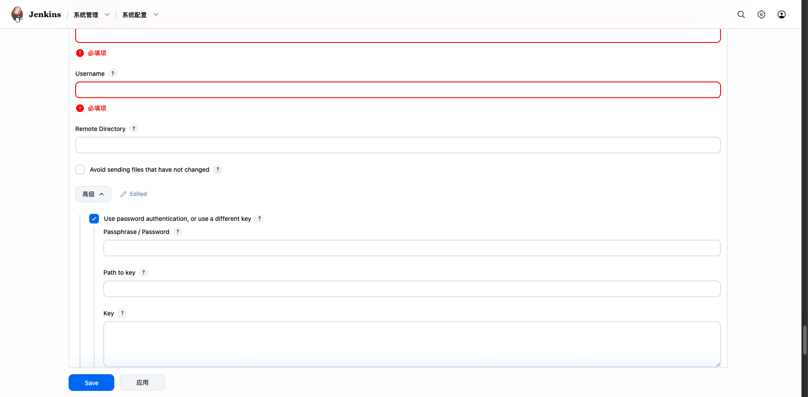
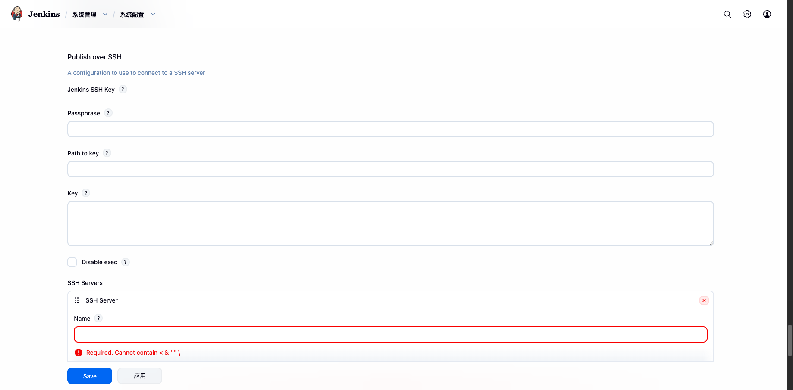
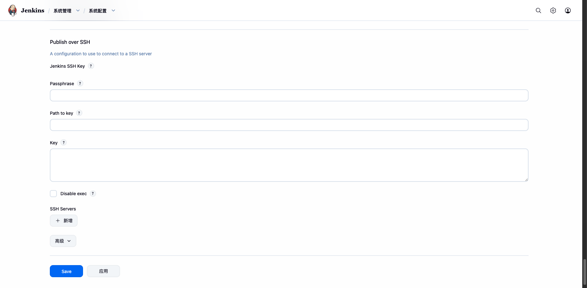

# Publish Over SSH 插件

Publish Over SSH 是 Jenkins 中最常用的部署插件之一。它可以在构建完成后，通过 SSH 将构建产物（文件/目录）传输到远程服务器，并在远程服务器上执行命令。

适用于 CI/CD 流水线的"部署"环节——构建完 jar/war/前端静态文件后，自动推送到目标机器并重启服务。

:::tip 前置条件
使用本插件前，请先完成 [Jenkins SSH 免密配置](../jenkins-ssh-config/)，确保 Jenkins 到目标机器的 SSH 密钥认证已就绪。
:::

## 插件作用

| 能力 | 说明 |
|------|------|
| **传输文件** | 通过 SFTP 将 Jenkins 工作空间中的文件/目录发送到远程服务器 |
| **执行远程命令** | 在远程服务器上执行 shell 命令（如重启服务、清理目录等） |
| **多服务器部署** | 一次配置多个 SSH 主机，构建时可同时部署到多台机器 |
| **密码加密存储** | 密码/密钥口令在配置文件和 UI 中均加密存储，不会明文暴露 |

## 安装插件

进入 **Manage Jenkins → Plugins → Available plugins**，搜索 `Publish Over SSH`，安装后重启 Jenkins。

## 全局配置

进入 **Manage Jenkins → Configure System**（系统管理 → 系统配置），找到 **Publish over SSH** 区域。

### Jenkins SSH Key（全局默认密钥）

这里配置的密钥是**全局默认密钥**，所有未单独配置认证信息的 SSH Server 都会使用它。



| 字段 | 说明 |
|------|------|
| **Passphrase** | 私钥的口令。如果私钥没有加密口令，留空即可 |
| **Path to key** | 私钥文件在 Jenkins 服务器上的路径，如 `/var/jenkins_home/.ssh/id_deploy` |
| **Key** | 直接粘贴私钥全文（包含 `-----BEGIN ... PRIVATE KEY-----` 头尾）。**如果填了 Key，Path to key 会被忽略** |
| **Disable exec** | 勾选后全局禁止执行远程命令，只允许传输文件 |

:::warning 二选一
**Path to key** 和 **Key** 两个字段**只需填一个**。如果两个都填了，以 Key（粘贴的私钥）为准，Path to key 会被忽略。
:::

### 添加 SSH Server

在 **SSH Servers** 区域点击 **Add** 按钮，填写目标主机信息：



| 字段 | 说明 |
|------|------|
| **Name** | 服务器名称（必填），在 Job 配置中通过此名称选择目标主机。不能包含 `< & ' "` 字符 |
| **Hostname** | 目标服务器的主机名或 IP 地址（必填） |
| **Username** | 登录目标服务器的用户名（必填）。该用户需要有远程目录的读写权限 |
| **Remote Directory** | 远程根目录。文件传输的目标路径会基于此目录。如填 `/opt/app`，则 Job 中传输的文件都会放到此目录下 |
| **Avoid sending files that have not changed** | 勾选后跳过未修改的文件（基于时间戳判断），加快传输速度 |

### 高级选项（认证与连接）

点击 SSH Server 行的 **Advanced** 按钮，展开高级配置：


#### 认证方式覆盖

勾选 **Use password authentication, or use a different key** 后，会展开以下字段，可以为**当前这台服务器**单独配置认证信息（覆盖全局默认密钥）：

| 字段 | 说明 |
|------|------|
| **Passphrase / Password** | 如果填了 Path to key 或 Key，这里是私钥的口令；如果 Key 和 Path to key 都没填，这里就是**密码登录**的密码 |
| **Path to key** | 该服务器专用的私钥文件路径 |
| **Key** | 该服务器专用的私钥全文（粘贴） |

:::tip 两种认证方式
- **密钥认证（推荐）**：在 Path to key 或 Key 中填入私钥。如果私钥有口令，在 Passphrase / Password 中填入口令
- **密码认证**：不填任何 Key 和 Path to key，直接在 Passphrase / Password 中填入登录密码
:::

#### 连接参数

| 字段 | 默认值 | 说明 |
|------|--------|------|
| **Jump host** | - | 跳板机地址（通过跳板机连接目标主机） |
| **Port** | `22` | SSH 端口号 |
| **Timeout (ms)** | `300000`（5 分钟） | 连接超时时间，单位毫秒 |
| **Disable exec** | - | 勾选后禁止在此服务器上执行远程命令，只允许传文件 |

#### 代理配置（可选）

如果 Jenkins 需要通过代理才能连接目标服务器，可配置：

| 字段 | 说明 |
|------|------|
| **Proxy type** | 代理类型：HTTP / SOCKS4 / SOCKS5 |
| **Proxy host** | 代理服务器地址 |
| **Proxy port** | 代理端口 |
| **Proxy user** | 代理认证用户名 |
| **Proxy password** | 代理认证密码 |

### 测试连接

配置完成后，点击 **Test Configuration** 按钮验证连接是否正常。



测试成功后显示 `Success`，然后点击页面底部的 **Save** 保存配置。

## 在 Job 中使用

### Freestyle 项目

在 Job 配置页面的 **Post-build Actions**（构建后操作）中，选择 **Send build artifacts over SSH**：

1. **SSH Server**：从下拉列表中选择已配置的服务器名称
2. **Transfers**：
   - **Source files**：要传输的文件，如 `target/*.jar` 或 `dist/**`
   - **Remove prefix**：去除路径前缀，如填 `target/` 则传输后文件名不含 `target/` 前缀
   - **Remote directory**：远程目标子目录（基于全局配置的 Remote Directory），如填 `v2.1.0` 则文件会放到 `/opt/app/v2.1.0/`
   - **Exec command**：文件传输完成后在远程服务器上执行的命令
3. 点击 **Advanced** 可配置：
   - **Exec timeout (ms)**：命令执行超时时间
   - **Exec in pty**：在伪终端中执行命令（某些命令需要）

:::warning 注意
**Source files** 和 **Exec command** 至少填一个。两个都为空时构建会失败。
:::

### Pipeline 项目

Pipeline 中使用 `publishOverSSH` 步骤：

```groovy
pipeline {
    agent any

    stages {
        stage('Build') {
            steps {
                sh 'mvn clean package -DskipTests'
            }
        }
        
        stage('Deploy') {
            steps {
                publishOverSSH(
                    publishers: [
                        sshPublisher(
                            configName: '生产服务器',     // 对应全局配置中的 SSH Server Name
                            transfers: [
                                sshTransfer(
                                    sourceFiles: 'target/app.jar',
                                    removePrefix: 'target/',
                                    remoteDirectory: 'app',
                                    execCommand: 'sudo systemctl restart myapp'
                                )
                            ]
                        )
                    ]
                )
            }
        }
    }
}
```

## 认证配置总结

整个插件的认证逻辑可以用下表概括：

| 场景 | 全局 Jenkins SSH Key | Server 高级覆盖 | 认证方式 |
|------|---------------------|----------------|----------|
| 所有服务器共用一把密钥 | 填入私钥 | 不勾选 | 全局密钥认证 |
| 某台服务器用密码登录 | 任意 | 勾选，只填 Password | 密码认证 |
| 某台服务器用不同密钥 | 任意 | 勾选，填入专用私钥 | 专用密钥认证 |
| 不填任何认证信息 | 留空 | 不勾选 | ❌ 无法连接 |

:::tip 安全建议
1. 推荐使用**密钥认证**而非密码认证
2. 如果配置页面可能被非管理员看到，务必给私钥设置口令
3. 密码和口令在 Jenkins 内部是加密存储的，但仍建议定期更换
:::

## 常见问题

### 连接被拒绝 / Authentication failed

1. 检查目标机的 SSH 服务是否运行：`systemctl status sshd`
2. 检查端口是否正确（默认 22）
3. 确认公钥已在目标机 `~/.ssh/authorized_keys` 中

### ssh-rsa 密钥在新版 OpenSSH 上认证失败

新版 OpenSSH（Ubuntu 20.04+/22.04+）默认禁用了 `ssh-rsa` 算法。两种解决方式：

**方式一**：在目标机允许 ssh-rsa（快速修复）

```bash
# 编辑目标机的 sshd 配置
sudo vi /etc/ssh/sshd_config

# 添加或取消注释
PubKeyAuthentication yes
PubKeyAcceptedKeyTypes=+ssh-rsa

# 重启 SSH 服务
sudo systemctl restart sshd
```

**方式二**：生成 ED25519 或 ECDSA 密钥替代 RSA（推荐）

```bash
# 生成 ECDSA 密钥
ssh-keygen -t ecdsa -m PEM -f ~/.ssh/id_ecdsa

# 将公钥分发到目标机
ssh-copy-id -i ~/.ssh/id_ecdsa.pub deploy@10.0.0.20
```

### Remote Directory 不存在

插件**不会自动创建**全局配置中的 Remote Directory。如果目录不存在，传输会失败。请提前在目标机上创建好目录并设置权限。

```bash
# 在目标机上执行
sudo mkdir -p /opt/app
sudo chown deploy:deploy /opt/app
```
